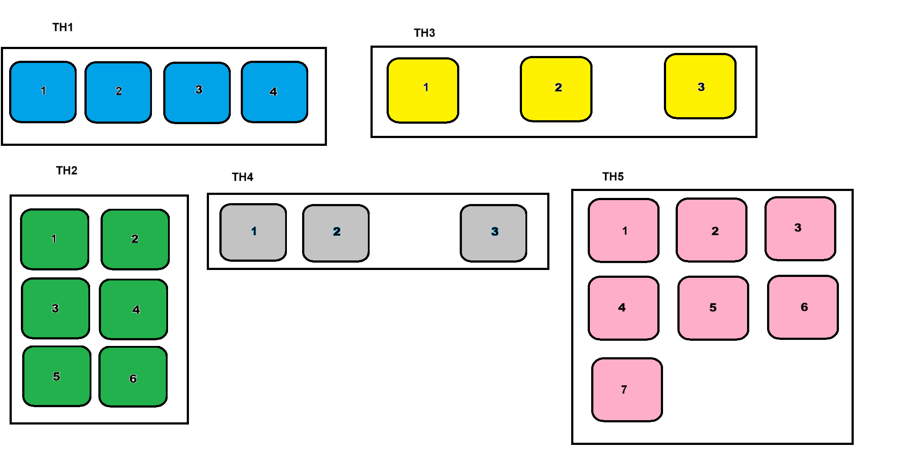

# **PHẦN A - KIỂM TRA ĐỌC HIỂU**

**Câu A1:**
| Position | Vẫn chiếm chỗ trong flow? | Tham chiếu vị trí | Cuộn theo trang? | Use case |
|----------|---------------------------|-------------------|------------------|----------|
| `static` | ✅ | Không dùng top/left | Cuộn theo trang như nội dung bình thường | Mặc định |
| `relative` | ✅ | Chính nó | Element vẫn cuộn theo trang | Dịch nhẹ, làm mốc cho absolute |
| `absolute` | ❌ | Cha relative gần nhất | Element vẫn cuộn theo trang nếu parent cuộn | Badge, dropdown, tooltip |
| `fixed` | ❌ | Viewport| Không cuộn theo trang |Chat button, modal overlay |
| `sticky` |✅ → ❌| Viewport(khi dính) | Cuộn bình thường cho tới khi chạm đỉnh màn hình → sau đó dính lại | Sticky header, sidebar |
- `Absolute` tham chiếu `body` khi Không có ancestor nào trước nó được position
- `Absolute` tham chiếu `parent` khi có ancestor được position 
- "Nearest positioned ancestor" Nghĩa là: Phần tử cha gần nhất có position khác static. Bao gồm:
    - position: relative;
    - position: absolute;
    - position: fixed;
    - position: sticky;

**Câu A2:**


# **PHẦN C - SUY LUẬN**
**Câu C1:**
| Tình huống | Nên dùng | Vì sao | 
|----------|---------------------------|-------------------|
| Navigation bar ngang (logo + menu + buttons) | Flexbox | Navbar là layout 1 chiều (theo hàng ngang). Flexbox rất tiện để căn giữa, đẩy item sang hai bên (justify-content: space-between), và responsive dễ. | 
| Lưới ảnh Instagram (3 cột đều nhau, số ảnh không biết trước) | Grid | Đây là layout 2 chiều (hàng + cột). Grid giúp tạo các cột đều nhau cực gọn bằng grid-template-columns: repeat(3, 1fr). Số ảnh bao nhiêu cũng tự xuống dòng đẹp. | 
| Layout blog: main content + sidebar | Grid | Có cấu trúc rõ ràng theo cột: nội dung chính + sidebar. Grid phù hợp để chia vùng layout tổng thể (2fr 1fr) và responsive dễ hơn. | 
| Footer với 4 cột thông tin | Grid (hoặc Flexbox nếu đơn giản) | Footer dạng nhiều cột đều nhau nên Grid rất tự nhiên. Nếu chỉ cần xếp ngang đơn giản thì Flexbox cũng được, nhưng Grid kiểm soát cột tốt hơn.| 
| Card sản phẩm (ảnh trên, text giữa, nút dưới — nút luôn dính đáy) |Flexbox| Card là bố cục 1 chiều theo cột. Dùng display: flex; flex-direction: column; rồi cho phần text flex-grow: 1 để nút luôn nằm sát đáy | 

**Câu C2:**
1. Lỗi 1: Cards không đều chiều cao — nút "Mua" bị nhảy lên/xuống
- Nguyên nhân: Các card có lượng text khác nhau nên chiều cao mỗi card khác nhau. Nút `.btn` nằm ngay sau nội dung nên vị trí nút bị lệch.
- Cách sửa: Dùng Flexbox theo chiều dọc cho card và đẩy nút xuống đáy bằng `margin-top: auto`.
```css
.card-container {display: flex; flex-wrap: wrap;}
.card {width: 30%; margin: 1.5%; display: flex; flex-direction: column;}
.card img {width: 100%;}
.card h3 {font-size: 18px;}
.card .btn { padding: 10px;
    margin-top: auto;/*Sửa ở dòng này*/
}
```
2. Muốn items nằm giữa cả ngang lẫn dọc trong container 100vh, nhưng item vẫn dính góc trái trên
- Nguyên nhân: 
    - `display: flex` chỉ bật Flexbox, nhưng chưa căn giữa.
    - Mặc định: ngang → `justify-content: flex-start`; dọc → `align-items: stretch`. Nên item vẫn nằm góc trên trái.
- Sửa: 
```CSS
.hero {
    height: 100vh;
    display: flex;
    justify-content: center;/*Sửa ở dòng này*/
    align-items: center;/*Sửa ở dòng này*/
}
.hero-content {
    text-align: center;
}
```
3. Sidebar bị co lại khi content quá dài
- Nguyên nhân: Trong Flexbox, item mặc định có: `flex-shrink: 1`; nên sidebar được phép co nhỏ khi content chiếm quá nhiều chỗ.
- Sửa: 
```css
.layout {display: flex;}
.sidebar {width: 250px;
    flex-shrink: 0;/*Sửa ở dòng này*/
}
.content {flex: 1;}
```
