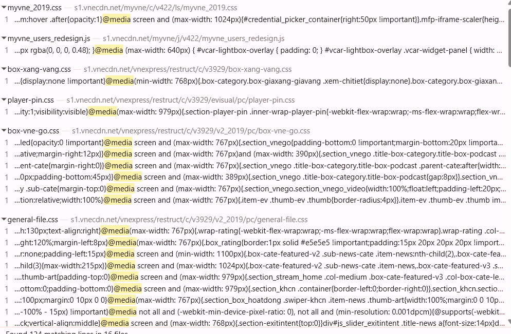

# **PHẦN A - KIỂM TRA ĐỌC HIỂU**

**Câu A1:**
1. 
```html
<meta name="viewport" content="width=device-width, initial-scale=1.0">
```
- width="device-width": Chiều rộng bằng kích thước của thiết bị
- initial-scale=1.0: Thu phóng kích cỡ ban đầu là 1.0 


2. Thiếu dòng này: iPhone sẽ coi trang web là web desktop và thu nhỏ xíu lại. Luôn đặt trong `<head>`

3. Mobile-First và Desktop-First là hai cách tiếp cận khi thiết kế/giao diện web responsive.
- Desktop-First: Bạn thiết kế giao diện cho màn hình lớn trước (desktop), rồi sau đó dùng media query để thu nhỏ và chỉnh sửa cho tablet/mobile.
```css
/* 1. Code cho desktop trước (mặc định) */
.col { width: 25%; }
@media (max-width: 1024px) { 
    .col { width: 50%; } 
    }
@media (max-width: 768px) {
    .col { width: 100%; } 
    }
```
- Mobile-First: Bạn thiết kế cho mobile trước, rồi mở rộng dần cho tablet và desktop bằng min-width

```css
/* 1. Code cho mobile trước (mặc định) */
.col { width: 100%; }

/* 2. Tablet: min-width = "từ kích thước này TRỞ LÊN" */
@media (min-width: 768px) {
    .col { width: 50%; }
}

/* 3. Desktop */
@media (min-width: 1024px) {
    .col { width: 25%; }
}
```
- Mobile-First được khuyên dùng vì: Điện thoại tải ít CSS hơn → nhanh hơn. Desktop thêm CSS = OK. Ngược lại = lãng phí.

**Câu A2:**
- Breakpoints chuẩn (Bootstrap):

| Tên | Kích thước | Thiết bị |Lưới sản phẩm
|---|---|---|---|
| **xs** | < 576px | Điện thoại dọc |1-2 cột
| **sm** | ≥ 576px | Điện thoại ngang |2 cột
| **md** | ≥ 768px | Tablet |3 cột
| **lg** | ≥ 992px | Desktop nhỏ |4 cột
| **xl** | ≥ 1200px | Desktop lớn |5 cột

**Câu A3:**
| Chiều rộng màn hình | `.container` width |
|---------------------|--------------------|
| 375px (iPhone SE) | 100% |
| 600px | 540px |
| 800px | 720px |
| 1000px | 960px |
| 1400px | 1140px |

**Câu A4:**
- Variables — Biến trong SCSS: Cho phép lưu giá trị vào biến để tái sử dụng nhiều nơi
```scss
$primary-color: #3498db;
$padding: 16px;
.button {
  background-color: $primary-color;
  padding: $padding;
}
```
- Nesting — Viết CSS lồng nhau: SCSS cho phép viết selector theo cấu trúc HTML.
```scss
.navbar {
  background: black;
  ul {
    list-style: none;
  }
  li {
    display: inline-block;
  }
  a {
    color: white;
    &:hover {
      color: yellow;/*& đại diện cho selector cha hiện tại*/
    }
  }
}
```
- Mixins — Tái sử dụng block CSS: Giống như “function” trong lập trình. Dùng để tái sử dụng nhiều đoạn CSS.
```scss
@mixin flex-center {
  display: flex;
  justify-content: center;
  align-items: center;
}
```
- @extend / Inheritance — Kế thừa CSS: Cho phép một class kế thừa style từ class khác.
```scss
.message {
  padding: 10px;
  border: 1px solid #ccc;
}
.success {
  @extend .message;/*Kế thừa từ class messeage*/
  border-color: green;
}
.error {
  @extend .message;/*Kế thừa từ class messeage*/
  border-color: red;
}
```
- Trình duyệt không đọc được file .scss vì trình duyệt chỉ hiểu HTML, CSS, JavaScript. SCSS là ngôn ngữ mở rộng của CSS
- Cần compile/transpile SCSS thành CSS. Quá trình: SCSS → Sass Compiler → CSS
- Công cụ compile phổ biến: Dart Sass

# **PHẦN B - THỰC HÀNH CODE**

**Câu B3:**
- Các lệnh sử dụng:
- Cài Sass
```bash
npm install -g sass
``` 
- Lệnh compile 
```bash
sass style.scss style.css
``` 
=> Lệnh này sẽ compile 3 file scss lại thành 1 file style.css

# **PHẦN C - PHÂN TÍCH**
**Câu C1:**
- Ở màn hình 375px , khi ấn vào hambuger ☰ thì bảng menu xổ xuống 1 dòng. Ở giao diện 768px vào 1024px thì khi chọn ☰ thì của sổ hiện ra nhiều cột menu
- Ở màn hình 375px lưới content gồm 1 cột. Màn hình 768px thì lưới content gồm 2-3 cột. Màn hình 1024px thì lưới content gồm 3-4 cột 
- Không có element nào bị ẩn trên mobile
- Ở màn hình 375px, tiêu đề 1 bài báo có font 22px, cỡ chữ 18px. Màn hình 768px cũng có tiêu đề 22px, cỡ cữ 18px. Lên đến giao diện 1024px thì tiêu đề 32px, cỡ chữ 18px.


**Câu C2:**
- Mobile wireframe:
```
+----------------------+
| LOGO      ☎ Hotline |
+----------------------+

+----------------------+
|                      |
|      HERO IMAGE      |
|                      |
+----------------------+

+----------------------+
|      MÓN ĂN 1        |
+----------------------+
|      MÓN ĂN 2        |
+----------------------+
|      ........        |
+----------------------+
+----------------------+
|      MÓN ĂN 6        |
+----------------------+

+----------------------+
|    FORM ĐẶT BÀN      |
| [Ngày]               |
| [Giờ]                |
| [Số người]           |
| [Ghi chú]            |
| [Đặt bàn]            |
+----------------------+

+----------------------+
|      GOOGLE MAP      |
+----------------------+

+----------------------+
|        FOOTER        |
+----------------------+
```
- Tablet wireframe:
```
+----------------------------------+
| LOGO            MENU    HOTLINE |
+----------------------------------+

+----------------------------------+
|                                  |
|            HERO IMAGE            |
|                                  |
+----------------------------------+

+---------------+------------------+
|    MÓN 1      |      MÓN 2       |
+---------------+------------------+
|    MÓN 3      |      MÓN 4       |
+---------------+------------------+
|    MÓN 5      |      MÓN 6       |
+---------------+------------------+

+----------------------------------+
|          FORM ĐẶT BÀN            |
+----------------------------------+

+----------------------------------+
|            GOOGLE MAP            |
+----------------------------------+

+----------------------------------+
|              FOOTER              |
+----------------------------------+
```
- Desktop wireframe
```
+------------------------------------------------------+
| LOGO          MENU NAVIGATION         ☎ HOTLINE     |
+------------------------------------------------------+

+------------------------------------------------------+
|                                                      |
|                     HERO IMAGE                       |
|                                                      |
+------------------------------------------------------+

+---------------+---------------+----------------------+
|    MÓN 1      |    MÓN 2      |      MÓN 3          |
+---------------+---------------+----------------------+
|    MÓN 4      |    MÓN 5      |      MÓN 6          |
+---------------+---------------+----------------------+

+--------------------------+---------------------------+
|                          |                           |
|      FORM ĐẶT BÀN        |        GOOGLE MAP         |
|                          |                           |
+--------------------------+---------------------------+

+------------------------------------------------------+
|                      FOOTER                          |
+------------------------------------------------------+
```
- MobileL có thể bị ẩn:
  - menu navigation đầy đủ
  - text mô tả dài
  - sidebar
  - ảnh phụ
- Form có thể nằm ở cuối trang hoặc ẩn. Khi ấn vào nút đặt hàng thì form mới xuất hiện
- Tablet: 
  - Grid ảnh: 2 cột
  - Form + map xếp dọc hoặc chia đôi nhẹ
- Desktop: 
  - Layout nhiều cột
  - Main content:
    - 2 cột (Form + Map)
    - Gallery: 3 cột
  - Sidebar: Không cần vì website nhà hàng cần visual rộng và đơn giản
- CSS skeleton:
```css
*{
  margin:0;
  padding:0;
  box-sizing:border-box;
}
body{
  font-family:Arial,sans-serif;
}
.container{
  display:grid;
  grid-template-columns:1fr;
  min-height:100vh;
}
/* HEADER */
header{
  background:#111;
  color:white;
  padding:16px;
}
/* HERO */
.hero{
  height:300px;
  background:#ccc;
}
/* GALLERY */
.gallery{
  display:grid;
  grid-template-columns:1fr;
  gap:16px;
  padding:16px;
}
.item{
  background:#e5e5e5;
  height:200px;
}
/* FORM + MAP */
.booking-map{
  display:grid;
  grid-template-columns:1fr;
  gap:20px;
  padding:16px;
}
.booking-form{
  background:#f3f3f3;
  min-height:300px;
}
.map{
  background:#d1d5db;
  min-height:300px;
}
/* FOOTER */
footer{
  background:#111;
  color:white;
  text-align:center;
  padding:20px;
}
/* =========================
   TABLET
========================= */
@media(min-width:768px){
  .gallery{
    grid-template-columns:repeat(2,1fr);
  }
}
/* =========================
   DESKTOP
========================= */
@media(min-width:1024px){
  .gallery{
    grid-template-columns:repeat(3,1fr);
  }
  .booking-map{
    grid-template-columns:1fr 1fr;
    align-items:start;
  }
}
```
