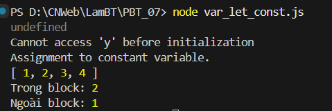
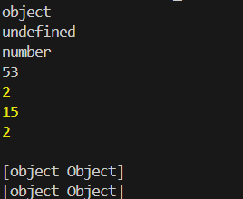
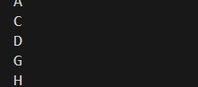

# **PHẦN A - KIỂM TRA ĐỌC HIỂU**

**Câu A1:**
- Dự đoán
```javascript
//Đoạn 1
//5

//Đoạn 2
//10

//Đoạn 3
//15

//Đoạn 4
//1,2,3,4

//Đoạn 5
//Trong Block:2
//Ngoài Block:1
```
- Chạy và so sánh

- Giải thích:
    - Đoạn 1 in ra undefined vì var được hoisting
    - Đoạn 2 lỗi ReferenceError: Cannot access 'y' before initialization. Vì let cũng được hoisting nhưng nằm trong Temporal Dead Zone. Tức là biến tồn tại nhưng chưa được phép truy cập trước dòng khai báo.
    - Đoạn 3, 4, 5 muốn chạy được thì các dòng lệnh phải được đặt trong try..catch

**Câu A2:**
- Dự đoán
```javascript
console.log(typeof null);              // object
console.log(typeof undefined);         // undefined
console.log(typeof NaN);              //  Nan
console.log("5" + 3);                 // 53
console.log("5" - 3);                 // 2
console.log("5" * "3");              // 15
console.log(true + true);            // 2
console.log([] + []);                // []
console.log([] + {});                // []
console.log({} + []);                // {}
```
- Kết quả:

- `"5" + 3` và `"5" - 3` cho kết quả khác nhau vì JavaScript tự chuyển 3 thành string rồi nối chuỗi. Còn các phép toán khác thì tính bình thường.

**Câu A3:**
```javascript
console.log(5 == "5");                // true
console.log(5 === "5");               // false
console.log(null == undefined);       // true
console.log(null === undefined);      // false
console.log(NaN == NaN);             // false
console.log(0 == false);             // true
console.log(0 === false);            // false
console.log("" == false);            // true
```
- Nên ưu tiên dùng: `===` thay vì: `==` trong hầu hết trường hợp. Vì `==` (so sánh lỏng). JavaScript sẽ tự ép kiểu trước khi so sánh. Còn `===`(so sánh nghiêm ngặt), so sánh giữa giá trị và kiểu dữ liệu.
- Trong JavaScript hiện đại và các framework như: React, Vue, jsAngular, hầu như luôn dùng `===`.

**Câu A4:**
- 6 giá trị FALSY (coi như false): `false, 0, "", null, undefined, NaN`
- Dự đoán
```javascript
if ("0") console.log("A");           // In
if ("") console.log("B");            // Không in
if ([]) console.log("C");            // In 
if ({}) console.log("D");            // In 
if (null) console.log("E");          // Không
if (0) console.log("F");             // Không
if (-1) console.log("G");            // In 
if (" ") console.log("H");           // In (space)
```
- Kết quả


**Câu A5:**
```javascript
//Cách 1
var greeting = `Xin chào ${name}! Bạn ${age} tuổi.`;
//Cách 2
var url = `https://api.example.com/users/${userId}/orders?page=${page}`;
//Cách 3
var html = `
<div class="card">
    <h2>${title}</h2>
    <p>${description}</p>
    <span>Giá: ${price}đ</span>
</div>
`;
```
# **PHẦN C - SUY LUẬN**
**Câu C1:**

| STT | Dòng | Mô tả | Tên lỗi|Cách sửa
|-----|-------|-------------------|--------|-------|
|Lỗi 1 | Dòng 3 | `return "Phần trăm giảm không hợp lệ"`|Thiếu `;` ở cuối. | `return "Phần trăm giảm không hợp lệ";`|
|Lỗi 2| Dòng 16 |`const gia = tinhGiaGiamGia("100000", 20)` | `"100000"` là string |`const gia = tinhGiaGiamGia(100000, 20)` |
|Lỗi 3 |Dòng 1 | `function tinhGiaGiamGia(giaBan, phanTramGiam)`|Không validate input | Thêm `if(typeof giaBan !== "number" or typeof phanTramGiam !== "number"){Xử lý}`| 
|Lỗi 4 |Dòng 6 | `var giamGia = giaBan * phanTramGiam / 100`|Dùng `var` thay vì `let` |`let giamGia = giaBan * phanTramGiam / 100`|
|Lỗi 5 |Dòng 9 | ` if (giaSauGiam = 0)`|Dùng `=` thay vì `===` |`if (giaSauGiam === 0)`|
|Lỗi 6 |Dòng 23 | ` for (var i = 0; i < 5; i++) `|dùng `var` thay vì `let` |` for (let i = 0; i < 5; i++) `| 
- Vì `var` có function scope, không có block scope. Trong khi đó `let` có block scope. Mỗi vòng lặp sẽ tạo ra một bản sao riêng của i.  
  

